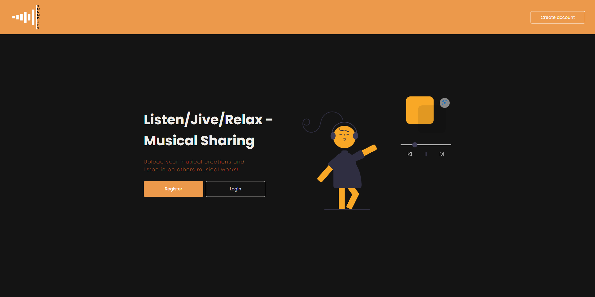
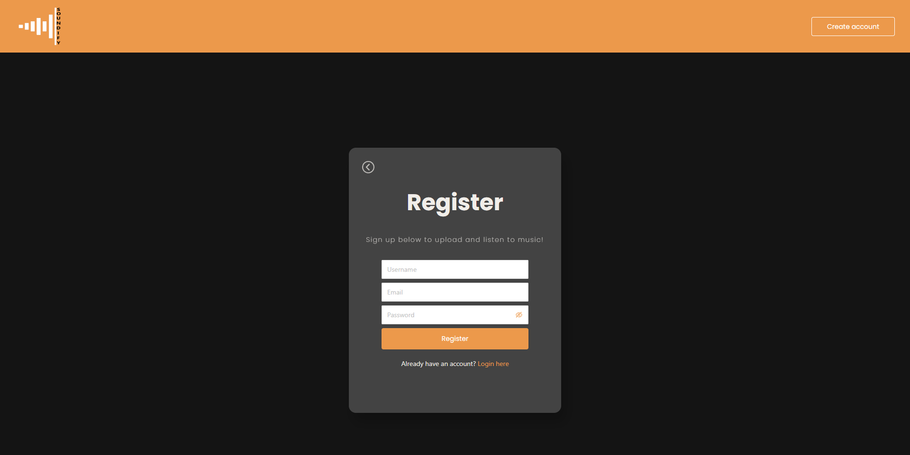
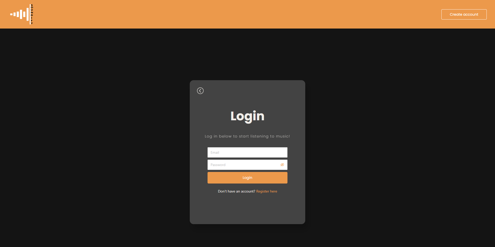
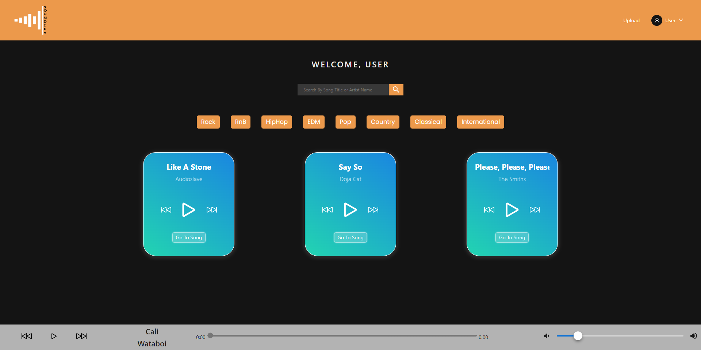
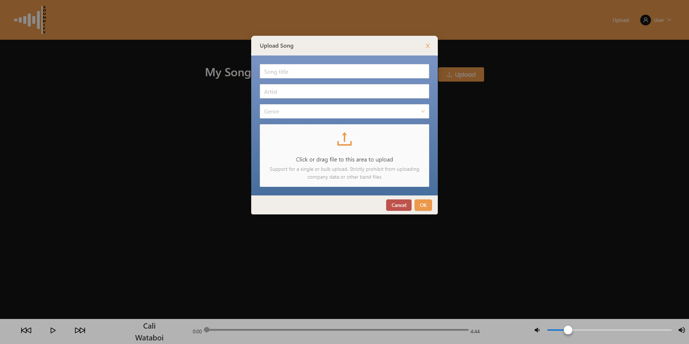
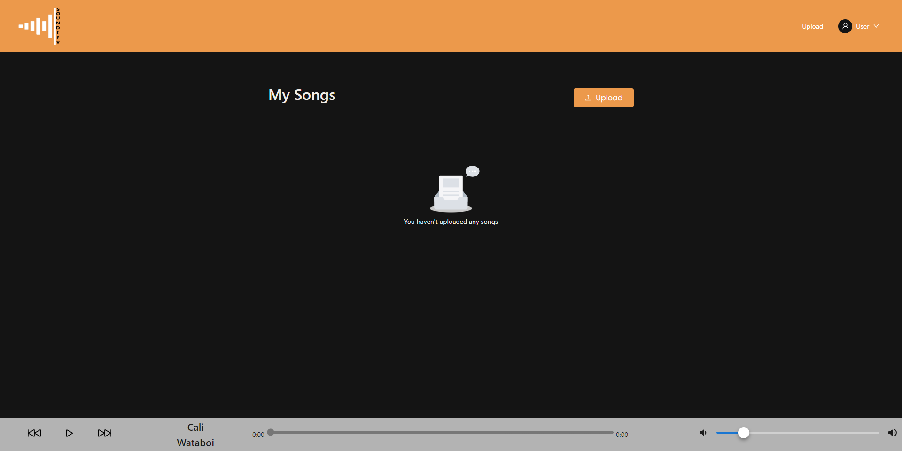
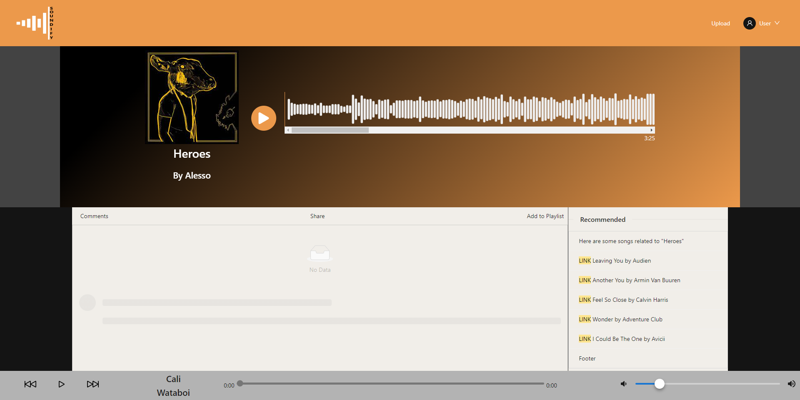

# Soundify - Group project-3

 

## Description:
---
Soundify is a online music player where users are required to create an account or login to our site to listen, upload, and comment on songs. Users will be allowed to either login or create a new & unique username and password in order to enter. After entering, users can listen to 3 seperate music cards on their dashboard. Users can also pick preselected genres to listen to. The user may use the search bar to search for song titles or artist names. At the bottom of the page is a interactive sound bar for users to listen to music regardless of which page they are on. The user can also upload songs by clicking "Upload". Next, the user will have to enter song title, artist name, and genre. Then the user will have to click or drag the music file to upload. The user will also be able to view their uploaded songs on this page. To view their playlist, users must click on the nav bar and click on "My Playlists". The user can then view thier playlist and the songs within. The user can click on the individual song and it will update and play on the music card. If the user wishes they can delete songs from the playlist by click the red "X" next to the song of their choice. Furthermore, users can log out of the site and still retain all the songs they downloaded. Whenever a user re-logs in to our site, the songs they have downloaded will still be on their account.

 

## User Story:
---
I love listening to music but I hate all the hoops I have to jump through to create an account on a major music playing platform. I have a lot of music and would love to create a personal playlist for those songs but I dont want to spend money. I want a application that I can login and upload all my favorite songs and create a playlist. I want to be able to view other peoples playlists. Other people can go to my uploaded songs or playlist and comment on them. If I decide I dont want a song anymore I want to be able to delete the song.

 

## Acceptance Criteria:
---
- Users must create a original username and password in order to login to our web application.
 

- Users must use username, email, and password to create a account.
 

- Users can listen to music from 3 differnt music cards on the users dashboard.
 

- Users can play music by choosing from preselected genres.
 

- Users can search song titles and artist names.
 

- Users can upload songs by entering the song name, artist name, genre, and the music file.
 

- Users can delete songs from playlists.
 

- Users can create a playlist with songs they have uploaded or by others.
 

- Users can log out and all their songs and playlist will be saved to their account.

 

## Table of Contents:
---
- [Heroku](#heroku)
- [Installation](#installation)
- [Usage](#usage)
- [Features](#features)
- [Contribute](#contribute)
- [Details](#details)
- [URL](#url)
- [Authors](#authors)
- [Credits](#credits)

 

## Heroku:
---

 

## Installation:
---
Go to the github link provided below and clone the repository. In VSC open terminal and use command "npm start" and then run "npm run dev" to view webpage.

 

## Usage:
---
[Screenshot1] Landing Page: Nav bar with logo and Create account feature. Short description with Register and Login feature.

 

[Screenshot2] Register: Create username, email, and password to register account.

 

[Screenshot3] Login: Enter email and password to login to account.
 

 

[Screenshot4] Dashboard: User is greated at dashboard and can upload or listen to songs on dashboard. User can search for individual songs or choose from a variety of genres.

 

[Screenshot5] Upload: User can click on upload in the nav bar and will be prompted with a page to enter a song title, artist, and genre. They can then click or drag to a area to upload a file.

 

[Screenshot6] Uploaded Songs: User can view all songs they have uploaded and view each one individualy.

 

[Screenshot7] Individual Songs: User can view the individual song by clicking "Go to Song". User can listen, comment, and view recommended songs.

 

## Contribute:
---
The github repository is publicaly viewable. If you wish to contribute to the project please reach out via email to one of the members for access.

 

## Details:
---
- Implemented npm packages with React.js

 

## URL:
---
To view Github repository click [here](https://github.com/lewisemarcus/SoundClone).

 

## Authors:
---
- Marcus Lewis
- Calvin Kim
- Jason Yoo
- Tyler Welker
- Brett Hockridge

## Credits:
--
